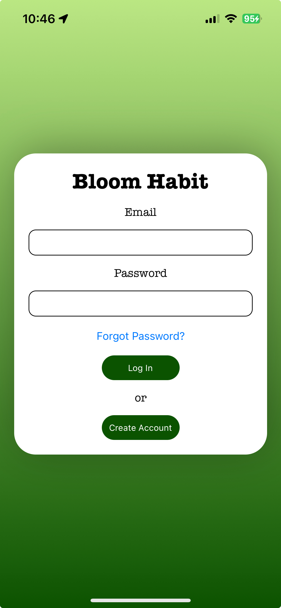

# 🌳 Bloom Habit Tracker

Bloom is a habit tracking app that allows for users to track habits while they grow a plant (exclusively virtually for now). The app comes with an scoring system that rewards users after they complete all the habits they set for themselves in a specific day. For example, if I have three habits, only after I complete those three habits, I will get points to make my plant grow (Which is determined by an emoji inside of the profile screen). 

## Screens

## Entity Relationship Diagram (ERD)

## Technologies Used

- [Axios](https://axios-http.com/docs/intro)
- [MongoDB Atlas](https://www.mongodb.com/atlas/database)
- [Express.js](https://expressjs.com/)
- [Expo](https://expo.dev/)
- [React Native](https://reactnative.dev/)
- [React Navigation](https://reactnavigation.org/)
- [Node.js](https://nodejs.org/en)

## Credit

Abraham Guerrero (Me!)
- [Github](https://github.com/AbeGue02)
- [LinkedIn](https://www.linkedin.com/in/abrahamdguerrero/)